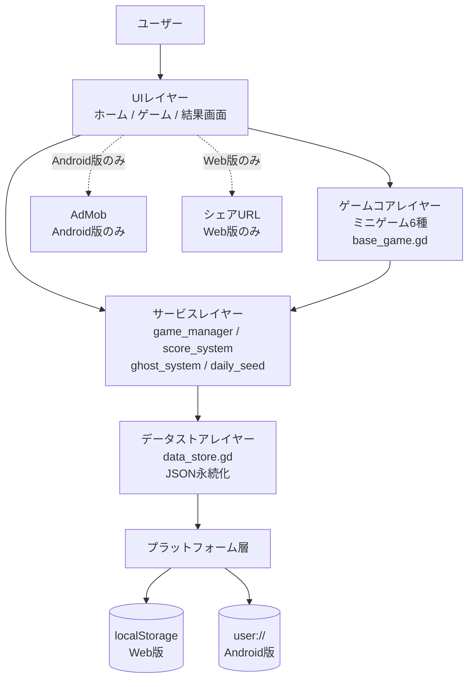
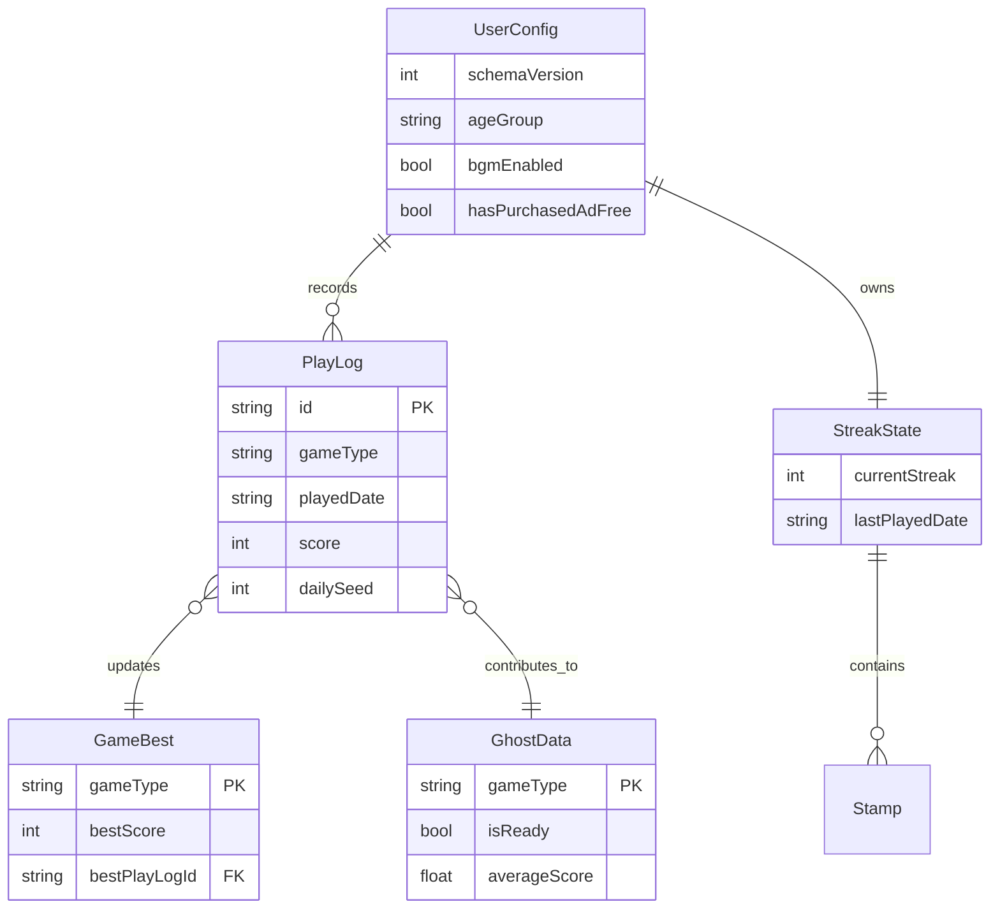
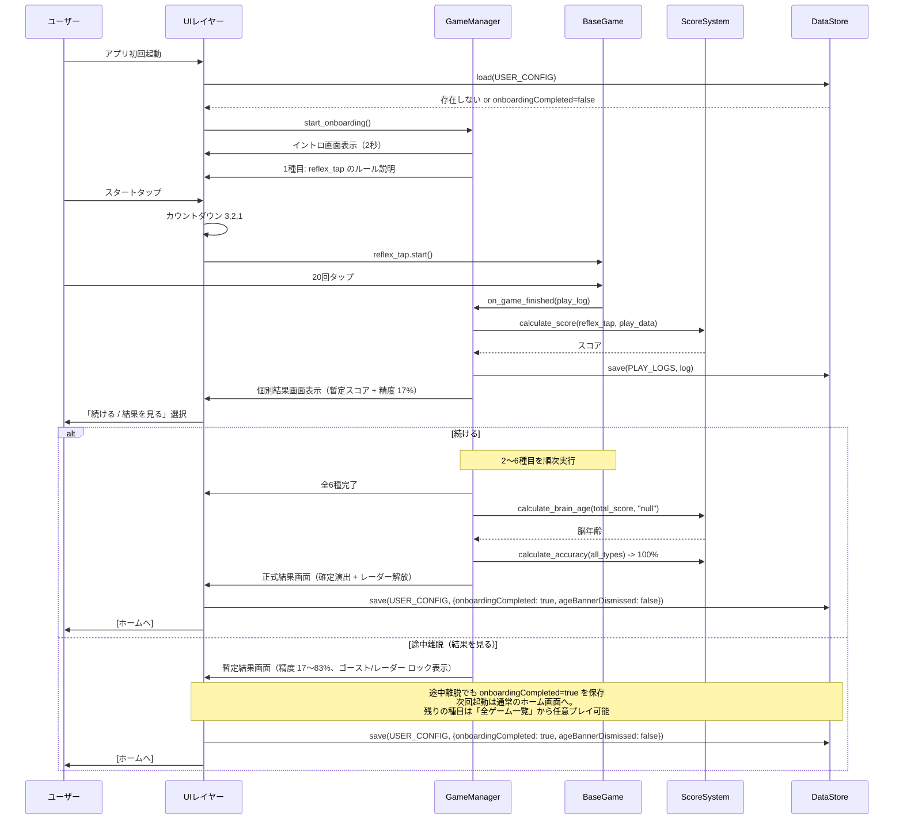
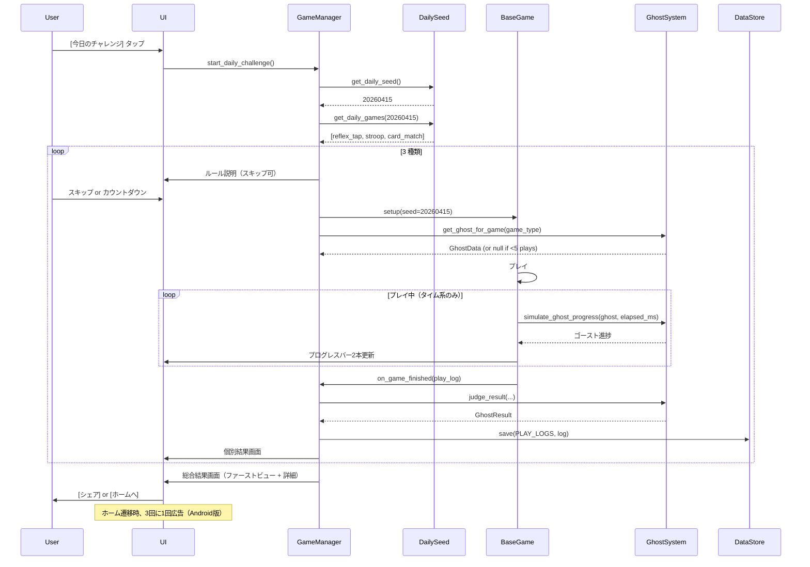
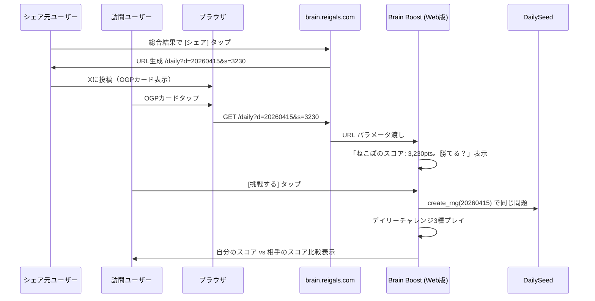
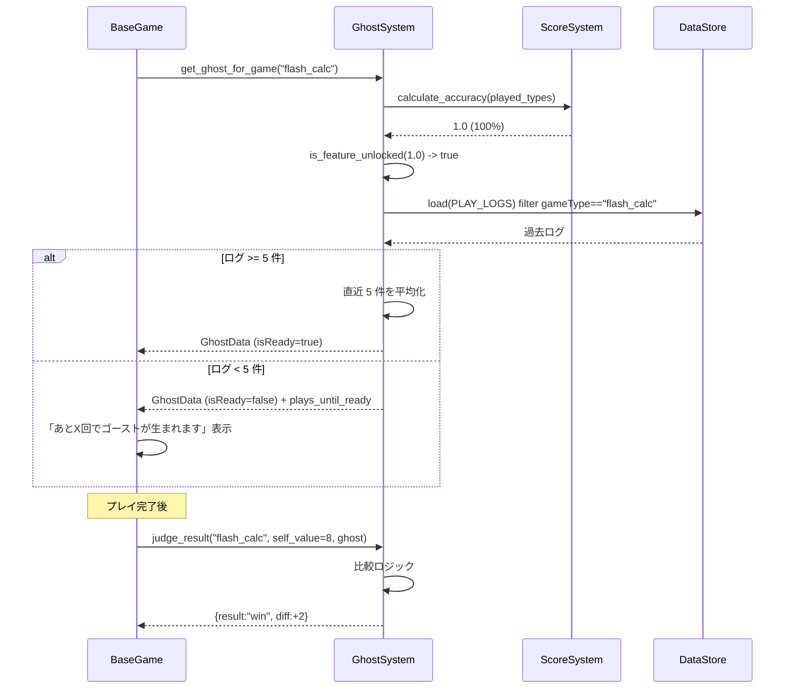
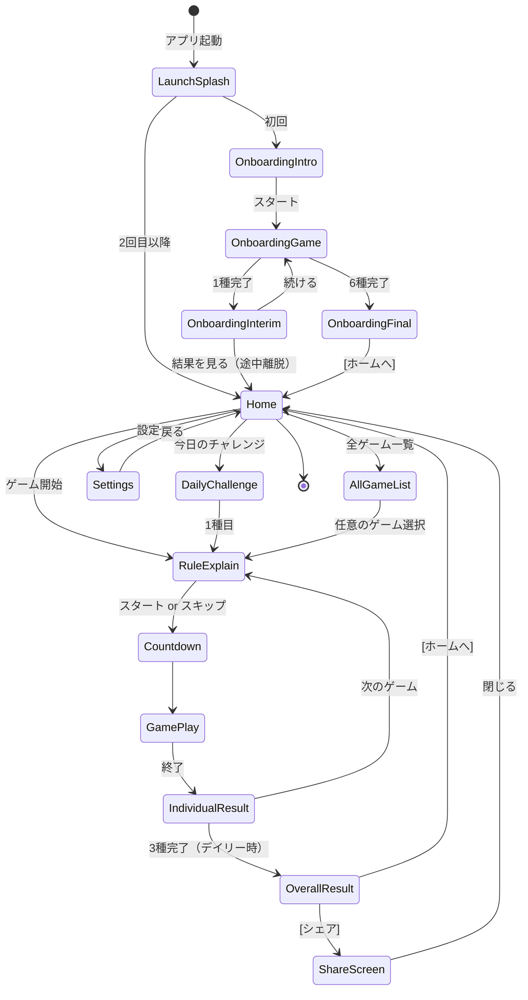

# 機能設計書 (Functional Design Document)

> **プロダクト**: Brain Boost
> **バージョン**: v1.0 (MVP)
> **最終更新**: 2026-04-10
> **出典PRD**: `docs/product-requirements.md`

PRDで定義された機能要件（FR-01 〜 FR-13）を、Godot 4 / GDScript で実現するための技術設計を定義する。

---

## システム構成図

Brain Boost は**サーバレスのクライアント単体アプリ**として構成される。Web版と Android版 は単一の Godot 4 プロジェクトから同時エクスポートされ、プラットフォーム固有の処理（広告・データ保存）のみ `OS.get_name()` で分岐する。



### レイヤー責務

| レイヤー | 責務 | 代表ファイル |
|---|---|---|
| **UI** | 画面遷移、入力受付、結果表示、アニメーション | `scenes/` 配下の `.tscn` + `scripts/ui/` |
| **ゲームコア** | ミニゲーム固有ロジック、問題生成、スコア計算 | `scripts/games/` + `scenes/games/` |
| **サービス** | 全体状態管理、ゴースト・スコア・シード生成などの共通ロジック | `scripts/core/` |
| **データストア** | JSON 形式での永続化、読込・保存のプラットフォーム分岐 | `scripts/core/data_store.gd` |
| **プラットフォーム層** | OS 分岐（Web: localStorage / Android: user://、AdMob、シェアURL） | 各種プラグイン + 条件分岐 |

---

## 技術スタック

| 分類 | 技術 | 選定理由 |
|---|---|---|
| **エンジン** | Godot 4.x | Web版（HTML5）と Android版を単一コードベースから同時エクスポート可能。無料・軽量・個人開発に最適 |
| **言語** | GDScript | Godot のネイティブ言語。学習コストが低く、シーン/ノードシステムとの親和性が高い |
| **ビルド/エクスポート** | Godot Editor + `export_presets.cfg` | Web/Android 両方の export preset を管理 |
| **Web版ホスト** | Cloudflare Pages | `brain.reigals.com` サブドメイン。既存 ReigalLabs インフラ流用。無料・高速・`_headers` での COOP/COEP 設定が可能 |
| **Android版配信** | Google Play（開発者登録 ¥3,800 / $25） | 日本市場での主要配信チャネル |
| **Android広告** | `godot-admob-plugin`（godot-sdk-integrations 版） | Godot 4 対応の AdMob プラグインで最もメンテされている |
| **Android課金** | Google Play Billing Library（Godot プラグイン経由） | 広告非表示買い切り課金（non-consumable）のため |
| **データ保存（Web）** | `JavaScriptBridge` 経由の `localStorage` | Web版は user:// が使えないため |
| **データ保存（Android）** | `user://` 配下の JSON ファイル | Godot 標準の永続化パス |
| **アセット** | フリー素材 + Godot UI テーマ | MVP スコープで自作は最低限 |
| **Web版の音声** | `AudioStreamPlayer` + ユーザー操作後の初期化 | ブラウザの自動再生制限回避 |
| **分析** | Firebase Analytics（v1.1 以降、Android のみ） | MVP では導入しない |

### Web版の技術的制約

- **SharedArrayBuffer 必須** → Cloudflare Pages の `_headers` で COOP/COEP を設定
  - `Cross-Origin-Opener-Policy: same-origin`
  - `Cross-Origin-Embedder-Policy: require-corp`
- **音声自動再生制限** → 初回タップで `AudioServer` を初期化
- **AdMob 不可** → Web版では広告関連のノードを生成しない
- **タッチ操作** → `viewport meta` と `touch-action: manipulation` を HTML シェルに設定

---

## データモデル定義

ローカル JSON ファイルとして永続化される主要エンティティを定義する。TypeScript の `interface` 記法で型を表現するが、実装は GDScript の `Dictionary` と型付きクラスで行う。

### エンティティ: UserConfig（ユーザー設定）

```typescript
interface UserConfig {
  schemaVersion: number;       // データフォーマットのバージョン（マイグレーション用）
  ageGroup: "10s" | "20s" | "30s" | "40s" | "50s+" | null;  // 年代。未設定なら null（基準年齢30歳として扱う）
  ageBannerDismissed: boolean; // 年代設定バナーを閉じたか（一度限り）
  bgmEnabled: boolean;         // BGM のオンオフ
  seEnabled: boolean;          // 効果音のオンオフ
  hasPurchasedAdFree: boolean; // 広告非表示買い切り購入済みか（Android版のみ使用）
  firstLaunchAt: string;       // 初回起動日時（ISO8601）
  lastPlayedAt: string;        // 最後にプレイした日時（ISO8601）
  onboardingCompleted: boolean; // 初回オンボーディングの完了フラグ
}
```

**制約**:
- `schemaVersion` は整数。MVP は `1`
- `ageGroup` が `null` の場合、脳年齢算出は基準年齢 30歳 で行う
- `bgmEnabled` `seEnabled` のデフォルトは `true`
- `hasPurchasedAdFree` のデフォルトは `false`。Web版では常に `false`

### エンティティ: PlayLog（プレイログ）

1 回のミニゲームプレイの詳細記録。ゴースト生成の元データ。

```typescript
interface PlayLog {
  id: string;                    // UUID
  gameType: GameType;            // "reflex_tap" | "flash_calc" | "number_search" | "stroop" | "sequence_memory" | "card_match"
  mode: "daily" | "free" | "onboarding";  // プレイモード
  playedAt: string;              // プレイ日時（ISO8601）
  playedDate: string;            // プレイ日（YYYY-MM-DD、ローカルタイム UTC+9）
  dailySeed: number | null;      // デイリーチャレンジ時は YYYYMMDD、それ以外は null
  score: number;                 // このプレイのスコア
  isNewBest: boolean;            // ベスト更新したか
  durationMs: number;            // プレイ時間（ms）
  events: PlayEvent[];           // タイムスタンプ付きイベント列
  ghostResult: GhostResult | null; // ゴースト対戦結果。5回未満は null
}

interface PlayEvent {
  timeMs: number;                // プレイ開始からの経過ミリ秒
  eventType: "correct" | "incorrect" | "tap" | "clear" | "miss";
  value: number | null;          // ゲーム固有の数値（例: 反射タップの反応時間）
}

interface GhostResult {
  result: "win" | "lose" | "draw";
  selfValue: number;             // 自分のスコア/タイム/正答数
  ghostValue: number;            // ゴーストのスコア/タイム/正答数
  diff: number;                  // 差分（自分 - ゴースト）
}

type GameType = "reflex_tap" | "flash_calc" | "number_search" | "stroop" | "sequence_memory" | "card_match";
```

**制約**:
- 1 プレイ 1 レコード。プレイ直後に保存する（クラッシュ対策）
- `playedDate` はローカルタイムの `YYYY-MM-DD` で、ストリーク判定・デイリー判定に使う
- `events` は MVP では必須保存だが、容量が問題になるなら直近 N 件のみ保持する運用に切り替え可能（`data_store.gd` に剪定ロジックを置く）

### エンティティ: GameBest（ゲーム別ベスト記録）

```typescript
interface GameBest {
  gameType: GameType;
  bestScore: number;
  bestPlayLogId: string;       // ベストを記録した PlayLog の id
  achievedAt: string;          // 達成日時
  totalPlayCount: number;      // そのゲームの総プレイ回数
}
```

### エンティティ: StreakState（ストリーク状態）

```typescript
interface StreakState {
  currentStreak: number;       // 現在の連続日数
  lastPlayedDate: string;      // 最後にプレイした日（YYYY-MM-DD）
  longestStreak: number;       // 過去最高のストリーク
  stampedDates: string[];      // ハンコが押された日付の配列（カレンダー表示用）
  welcomeBackShown: boolean;   // 今回の復帰演出を表示済みか
}
```

**ストリーク更新ロジック**（FR-09）:

`welcomeBackShown` は**「今回の復帰演出をすでに見せたか」**を意味する。`false` になると次回のホーム画面描画時に復帰演出が1度だけ表示され、演出後に `true` が立つ。

```text
現在日をD、lastPlayedDate を L とすると、
diff = D - L（日数）

if diff == 0:  何もしない（同日再プレイ）
if diff == 1:  currentStreak += 1、welcomeBackShown は変更しない
if 2 <= diff <= 7:  currentStreak += 1、welcomeBackShown = false（次回ホームで復帰演出を表示）
if diff >= 8:  currentStreak = 1、welcomeBackShown = true（リセットでは復帰演出を出さない）

stampedDates に D を追加、longestStreak を必要に応じて更新。
```

**設計意図**: `diff >= 8` のリセット時は「もう連続はゼロからやり直し」なので、「おかえりなさい」ではなく通常のホーム画面として表示する。復帰演出は `2 <= diff <= 7` の「惜しかったね、続けられたね」ケース専用。

### エンティティ: GhostData（派生データ・キャッシュ）

直接保存するのではなく、`PlayLog` から動的に計算するが、キャッシュしておくと高速化できる。

```typescript
interface GhostData {
  gameType: GameType;
  baseLogIds: string[];        // 直近 5 件の PlayLog.id
  isReady: boolean;            // 5 件揃っているか
  averageEvents: PlayEvent[];  // 平均化されたイベント列（プログレスバー再生用）
  averageScore: number;        // 平均スコア
  averageDurationMs: number;   // 平均プレイ時間
  computedAt: string;          // 計算日時
}
```

**キャッシュ無効化**: 新しい `PlayLog` が保存されたら、そのゲームタイプの `GhostData` を再計算する。

### ER図（論理関係）



---

## コンポーネント設計

### core/GameManager（全体状態管理）

**責務**:
- アプリ全体のライフサイクル管理（初回起動判定、オンボーディング進行）
- 現在のプレイモード（daily / free / onboarding）の保持
- シーン遷移の調停

**インターフェース**（GDScript 風）:
```gdscript
class_name GameManager
extends Node

signal onboarding_completed
signal daily_challenge_started(game_types: Array[String])
signal game_finished(play_log: PlayLog)

var current_mode: String  # "daily" | "free" | "onboarding"
var current_game_index: int
var current_session_logs: Array[PlayLog]

func start_onboarding() -> void
func start_daily_challenge() -> void
func start_free_game(game_type: String) -> void
func on_game_finished(log: PlayLog) -> void
func get_progress_percent() -> int
```

**依存**: ScoreSystem, GhostSystem, DailySeed, DataStore

### core/ScoreSystem（スコア・脳年齢算出）

**責務**:
- 各ゲームの生スコア計算（PRD FR-04 の計算式）
- 総合スコアから脳年齢への変換
- 能力軸へのマッピング（レーダーチャート用）
- 精度（プレイ済み種目数 / 全種目数）の算出

**インターフェース**:
```gdscript
class_name ScoreSystem
extends Node

const GAME_TO_ABILITY = {
    "flash_calc": "calculation",
    "sequence_memory": "memory",
    "stroop": "attention",
    "reflex_tap": "reflex",
    "number_search": "observation",
    "card_match": "judgment",
}

func calculate_score(game_type: String, play_data: Dictionary) -> int

## 初回補正（`is_first_play` の場合に甘め）とシード付き RNG 注入をサポート
func calculate_brain_age(
    total_score: int,
    age_group: String,
    is_first_play: bool = false,
    rng: RandomNumberGenerator = null
) -> int

func calculate_accuracy(played_game_types: Array) -> float  # 0.0 - 1.0
func get_ability(game_type: String) -> String  # 能力軸マッピング
```

**脳年齢アルゴリズム詳細は「アルゴリズム設計」セクション参照。**

### core/GhostSystem（ゴースト生成・対戦判定）

**責務**:
- 直近 5 プレイからゴーストデータを生成
- プレイ中のゴースト進捗をシミュレート（プログレスバー用）
- ゴースト対戦結果の判定（勝ち/負け/引き分け）
- 機能解放判定（精度 100% の第1段階）とデータ成立判定（5回蓄積の第2段階）

**インターフェース**:
```gdscript
class_name GhostSystem
extends Node

func is_feature_unlocked(accuracy: float) -> bool  # 第1段階: 精度 100% 判定

## 第2段階: そのゲームの PlayLog 件数が 5 以上か
## 注: 引数はカウント（int）を直接渡す設計にしている。
## DataStore への逆依存を避けるため、呼び出し側（GameManager）でカウント済みの値を渡す
func is_ready_for_game(play_log_count: int) -> bool

## 「あと○回でゴーストが生まれます」用の残り回数（同上、カウントを渡す設計）
func get_plays_until_ready(play_log_count: int) -> int

## 直近 5 件の PlayLog からゴーストデータを生成する
func compute_ghost(game_type: String, recent_logs: Array) -> GhostData

func simulate_ghost_progress(ghost: GhostData, elapsed_ms: int) -> Dictionary
func judge_result(game_type: String, self_value: float, ghost: GhostData) -> Dictionary  # GhostResult
```

### core/DailySeed（日付シード生成）

**責務**:
- 今日の日付から整数シードを生成
- シードに基づく RNG の初期化
- その日に選ばれるゲーム 3 種の決定（6 種から RNG で選出）

**インターフェース**:
```gdscript
class_name DailySeed
extends Node

const ALL_GAMES = ["reflex_tap", "flash_calc", "number_search", "stroop", "sequence_memory", "card_match"]

func get_daily_seed(date: Dictionary = Time.get_date_dict_from_system()) -> int
# 例: 2026/04/15 -> 20260415

func get_daily_games(seed: int) -> Array[String]
# 6種から3種を選出（全ユーザー同一）

func create_rng(seed: int) -> RandomNumberGenerator
```

**実装例**:
```gdscript
func get_daily_seed(date: Dictionary = Time.get_date_dict_from_system()) -> int:
    return date.year * 10000 + date.month * 100 + date.day

func get_daily_games(seed: int) -> Array[String]:
    var rng := RandomNumberGenerator.new()
    rng.seed = seed
    var pool: Array[String] = ALL_GAMES.duplicate()
    # ⚠️ Array.shuffle() はグローバル乱数を使うため、ここでは Fisher-Yates を rng で手動実装する。
    # シード付き RNG で全ユーザー共通の結果にするには、rng.randi() を介する必要がある。
    for i in range(pool.size() - 1, 0, -1):
        var j: int = rng.randi() % (i + 1)
        var tmp: String = pool[i]
        pool[i] = pool[j]
        pool[j] = tmp
    return pool.slice(0, 3)
```

**重要**: Godot 4 の `Array.shuffle()` は `RandomNumberGenerator` インスタンスのシードを無視し、グローバル乱数 `randomize()` に依存する。デイリーチャレンジは全ユーザー共通問題の前提なので、必ず **Fisher-Yates を `rng.randi()` で手動実装**すること。この規則は新ゲーム追加時にも守ること。

### core/DataStore（永続化・プラットフォーム分岐）

**責務**:
- JSON データの読み書き
- プラットフォーム判定による保存先の切り替え
- スキーマバージョンのマイグレーション

**インターフェース**:
```gdscript
class_name DataStore
extends Node

enum StoreKey {
    USER_CONFIG,
    PLAY_LOGS,
    GAME_BESTS,
    STREAK_STATE,
    GHOST_CACHE,
}

func save(key: StoreKey, data: Dictionary) -> bool
func load(key: StoreKey) -> Dictionary
func exists(key: StoreKey) -> bool
func clear(key: StoreKey) -> void
func migrate_if_needed(current_version: int) -> void
```

**プラットフォーム分岐**:

`OS.get_name()` を直接呼ばず、必ず `scripts/autoload/platform.gd`（Autoload 名 `Platform`）経由で判定する（`docs/architecture.md` のプラットフォーム分岐戦略参照）。

```gdscript
func _get_native_path(key: StoreKey) -> String:
    return "user://%s.json" % StoreKey.keys()[key].to_lower()

func _get_web_key(key: StoreKey) -> String:
    return "brainboost_%s" % StoreKey.keys()[key].to_lower()

func save(key: StoreKey, data: Dictionary) -> bool:
    var json_text: String = JSON.stringify(data)
    match Platform.current():
        Platform.Target.WEB:
            return _save_web(key, json_text)
        _:
            return _save_native(key, json_text)

func _save_native(key: StoreKey, json_text: String) -> bool:
    var path: String = _get_native_path(key)
    # 原子的な保存: 一時ファイルに書いてからリネーム
    var tmp_path: String = path + ".tmp"
    var file := FileAccess.open(tmp_path, FileAccess.WRITE)
    if file == null:
        push_error("DataStore: failed to open %s: %s" % [tmp_path, FileAccess.get_open_error()])
        return false
    file.store_string(json_text)
    file.close()
    var dir := DirAccess.open("user://")
    if dir == null or dir.rename(tmp_path, path) != OK:
        push_error("DataStore: failed to rename %s -> %s" % [tmp_path, path])
        return false
    return true

func _save_web(key: StoreKey, json_text: String) -> bool:
    # JavaScriptBridge.eval の文字列埋め込みは脆弱なため、
    # JavaScript オブジェクト経由で localStorage.setItem を呼ぶ。
    # window.brainboostBridge に Godot 側から Variant を渡して JS 側でアクセスする。
    var js_key: String = _get_web_key(key)
    # Godot 4: create_object / set_value を使って安全に値を渡す
    JavaScriptBridge.eval("""
        (function() {
            try {
                var k = '%s';
                var v = %s;
                localStorage.setItem(k, JSON.stringify(v));
                return true;
            } catch (e) {
                console.error('DataStore save failed', e);
                return false;
            }
        })();
    """ % [js_key, json_text], true)
    # json_text は JSON.stringify の出力のため、JS のリテラルとしても valid な形式。
    # ただし <script>-injection 等を避けるため、ユーザー入力由来の文字列を生で渡さない設計を維持する。
    return true
```

**注意点**:
- `JavaScriptBridge.eval()` に文字列補間でデータを渡すのは原則として脆弱だが、`JSON.stringify()` の出力は JS リテラルとしても valid（`"` エスケープ済み、改行エスケープ済み）なため本実装では許容する。
- ユーザーが自由入力できるフィールド（MVP には存在しない）を追加する際は、`btoa()` による base64 エンコードか、`JavaScriptBridge.create_object()` による直接オブジェクト渡しに切り替える
- ネイティブ版では一時ファイル → rename の**原子的保存**を行い、書き込み途中のクラッシュでデータが壊れないようにする

### games/BaseGame（ミニゲーム基底クラス）

**責務**:
- 全ミニゲーム共通のライフサイクル定義
- タイマー管理、入力受付、プレイログ生成
- ゴースト進捗のリアルタイム更新（タイム系のみ）

**インターフェース**:
```gdscript
class_name BaseGame
extends Node

signal game_started
signal game_finished(play_log: PlayLog)

var game_type: String  # サブクラスで設定
var is_time_based: bool  # タイム系ならプレイ中にゴーストバーを出す
var rng: RandomNumberGenerator  # デイリー時はシード付き
var events: Array[Dictionary]
var start_time_ms: int

func setup(seed: int = -1) -> void  # seed == -1 でランダム
func start() -> void  # 仮想
func on_user_input(input: Dictionary) -> void  # 仮想
func on_finish() -> PlayLog  # 仮想
func record_event(event_type: String, value = null) -> void
```

### ui/HomeScreen, ui/GameResult, ui/Onboarding, ui/ShareUrl 他

**責務**: 各画面の UI ロジック。詳細は「画面遷移図」「ユースケース図」参照。

---

## ユースケース図

### UC-01: 初回オンボーディング（FR-06）



**設計意図**: 途中離脱でも `onboardingCompleted = true` を保存する理由は、「初めてのユーザー体験は完了した」ことを表現するため。次回起動時に再びオンボーディングを繰り返すのではなく、通常のホーム画面に遷移させる。未プレイ種目は「全ゲーム一覧」から任意でプレイでき、プレイすると精度が上がってゴースト対戦機能解放（第1段階）に近づく。

### UC-02: デイリーチャレンジ 1 ラウンド（FR-07 / FR-03）



### UC-03: Web版シェアURL からの流入（FR-11）



### UC-04: ゴースト生成・対戦判定（FR-02）



---

## 画面遷移図



---

## API設計（該当する場合）

Brain Boost はサーバ API を持たない。唯一の外部インターフェースは **Web版シェアURL**。

### Web版シェア URL スキーマ

```
https://brain.reigals.com/daily?d={date}&s={score}
```

**パラメータ**:

| 名前 | 型 | 必須 | 説明 |
|---|---|---|---|
| `d` | 8桁文字列 | 必須 | デイリーチャレンジの日付（`YYYYMMDD`）。正規表現 `^\d{8}$` |
| `s` | 整数 | 任意 | シェアした人のスコア（0以上）。省略可 |

**訪問時の挙動**:

| 状態 | 挙動 |
|---|---|
| `d` が今日の日付 | 「ねこぽのスコア: ○○pts。勝てる？」表示 → [挑戦する] で同じ3種プレイ |
| `d` が過去の日付 | 「○月○日のデイリーチャレンジ」として表示、過去問として挑戦可能 |
| `d` が未来の日付 | 「まだ挑戦できません」エラー表示、ホームへ誘導 |
| `d` が不正（非数字・桁数違い・実在しない日付） | ホームへリダイレクト |
| `s` が負の整数や非数値 | `s` を無視して日付のみで処理 |
| パラメータなし | 通常起動（ホーム画面） |

**OGPメタタグ**:
```html
<meta property="og:title" content="今日の脳トレ: {score}pts - 勝てる？">
<meta property="og:description" content="Brain Boost デイリーチャレンジ {YYYY/MM/DD}">
<meta property="og:image" content="https://brain.reigals.com/ogp/default.png">
<!-- v1.1 で動的生成: /ogp/daily/{date}/{score}.png -->
```

**MVP の OGP 画像**: 日付とスコアを焼き込まない**静的 PNG 1枚**を使う。動的生成は v1.1 以降に延期（Cloudflare Workers での画像生成が必要になるため）。

---

## アルゴリズム設計

### A-01: 各ミニゲームのスコア算出（FR-04）

| ゲーム | 計算式 | 範囲 |
|---|---|---|
| **フラッシュ暗算** | `score = correctCount * 100 + remainingSec * 10` | 0 〜 4,000 |
| **順番記憶** | `score = maxReachedLevel * 150` | 0 〜 3,000 |
| **ストループ** | `score = correctCount * 100 - incorrectCount * 50`（下限 0） | 0 〜 3,000 |
| **反射タップ** | `score = (1000 / averageReactionMs) * 300`（上限 1,500） | 0 〜 1,500 |
| **神経衰弱** | `score = (pairCount / totalTapCount) * 1000 + max(0, timeBonus)` | 0 〜 2,500 |
| **数字さがし** | `score = max(0, 3000 - clearTimeSec * 100)` | 0 〜 3,000 |

**実装例**（GDScript）:
```gdscript
func calculate_score(game_type: String, play_data: Dictionary) -> int:
    match game_type:
        "flash_calc":
            return play_data.correct_count * 100 + play_data.remaining_sec * 10
        "sequence_memory":
            return play_data.max_reached_level * 150
        "stroop":
            return max(0, play_data.correct_count * 100 - play_data.incorrect_count * 50)
        "reflex_tap":
            if play_data.average_reaction_ms <= 0:
                return 0
            return min(1500, int((1000.0 / play_data.average_reaction_ms) * 300.0))
        "card_match":
            if play_data.total_tap_count == 0:
                return 0
            var efficiency = float(play_data.pair_count) / float(play_data.total_tap_count) * 1000.0
            return int(efficiency + max(0, play_data.time_bonus))
        "number_search":
            return max(0, 3000 - play_data.clear_time_sec * 100)
        _:
            return 0
```

### A-02: 脳年齢算出（FR-04）

**目的**: 総合スコアを「脳年齢」（歳）に翻訳する。

**仕様の背景**: GDD §6 と PRD FR-04 で定義された「初回プレイは基準年齢 -3〜5歳」「基準年齢 +10歳 を超えないキャップ」を実装する。下限クランプ（`center - 15`）は上限とほぼ対称の範囲を確保し、非現実的な値の抑止と A-02 の数値域の予測可能性のために追加する設計判断。絶対下限 10 歳は 10 代ユーザーの境界ケースでも 10 歳未満にならないようにする保険。

**計算ロジック**:

#### ステップ1: 年代の中央年齢を決定
```
ageGroup → centerAge:
  "10s"  -> 15
  "20s"  -> 25
  "30s"  -> 30（null / 未設定の場合のデフォルト値）
  "40s"  -> 45
  "50s+" -> 55
  null   -> 30
```

#### ステップ2: 合計スコアの正規化
6 ゲームすべてプレイした前提で、各ゲームの理論満点合計 `MAX_TOTAL = 17000` を分母にして `0.0 〜 1.0` の範囲に正規化する。
```
normalized = clamp(totalScore / MAX_TOTAL, 0.0, 1.0)
```

#### ステップ3: 生の脳年齢を計算
高スコアほど若返る線形変換。範囲は「中央年齢 - 10」〜「中央年齢 + 10」。
```
rawBrainAge = centerAge + 10 - (normalized * 20)
```
- `normalized = 0.0` → `centerAge + 10`（最悪ケース、+10歳）
- `normalized = 0.5` → `centerAge`
- `normalized = 1.0` → `centerAge - 10`（最高ケース、-10歳）

#### ステップ4: 初回補正 + キャップ
```
if isFirstPlay:
    brainAge = rawBrainAge - rng.randi_range(3, 5)  # 3 / 4 / 5 のいずれかで若返る（甘め）

# 上限キャップ: PRD FR-04 の「基準年齢 +10歳 を超えない」
# 下限クランプ: 上限との対称性 (-15) + 非現実的な値（例: 0 歳）の抑止
brainAge = clamp(brainAge, centerAge - 15, centerAge + 10)

# 絶対下限 10歳: 10代ユーザーの初回補正 + 高スコア時に 0 歳や負値が出ないようにする保険
brainAge = max(brainAge, 10)
```

#### ステップ5: 表示形式の決定
- 精度 < 100% → 「約 ○○ 歳」
- 精度 = 100% → 「○○ 歳（確定）」

**実装例**:
```gdscript
const MAX_TOTAL_SCORE: int = 17000
const AGE_GROUP_CENTER: Dictionary = {"10s": 15, "20s": 25, "30s": 30, "40s": 45, "50s+": 55}

func calculate_brain_age(total_score: int, age_group: String, is_first_play: bool, rng: RandomNumberGenerator = null) -> int:
    if rng == null:
        rng = RandomNumberGenerator.new()
        rng.randomize()
    var center: int = AGE_GROUP_CENTER.get(age_group, 30)  # null/未知の年代は 30
    var normalized: float = clamp(float(total_score) / float(MAX_TOTAL_SCORE), 0.0, 1.0)
    var raw: float = float(center) + 10.0 - (normalized * 20.0)
    if is_first_play:
        raw -= float(rng.randi_range(3, 5))  # 3/4/5 のいずれか
    # 上限: center + 10（PRD FR-04 キャップ）/ 下限: center - 15（対称範囲）
    var capped: int = int(clamp(raw, float(center - 15), float(center + 10)))
    return max(capped, 10)  # 絶対下限 10 歳
```

**ユニットテストの要点**:
- `(total_score=0, age="30s", first_play=false)` → `40` 歳
- `(total_score=17000, age="30s", first_play=false)` → `20` 歳
- `(total_score=17000, age="10s", first_play=true, rng固定=5)` → `max(10, clamp(15-10-5, 0, 25)) = max(10, 0) = 10`
- 負のスコアや `MAX_TOTAL_SCORE` を超える異常値でもクランプが効くこと

### A-03: ゴースト生成（直近5回平均化）（FR-02）

**目的**: 過去 5 プレイのイベント列を時間軸で平均化し、ゴーストの「各時点での正答数」を算出する。タイム系ゲーム（反射タップ・暗算・ストループ）で使用する。

**クリア系ゲーム（順番記憶・神経衰弱・数字さがし）の扱い**: クリア系ではプレイ中にゴーストバーを出さないため、`averageEvents` の計算は**スキップ可**（空配列のまま）。代わりに以下を計算して結果画面で比較表示に使う:

- `averageScore`: 直近5回のスコア平均
- `averageDurationMs`: 直近5回のクリアタイム平均（クリアしきれなかったプレイは `durationMs` を打ち切り値として含める）
- `averageTapCount`（神経衰弱のみ）: 直近5回の総タップ数平均

クリア系の `GhostResult` 判定は `averageDurationMs` と `averageScore` を `ghostValue` として使い、自分の `durationMs` / `score` と比較する。

**計算ロジック**:

#### ステップ1: 対象ログの抽出
```
logs = load_play_logs()
    .filter(l => l.gameType == targetGame)
    .sort_by(playedAt desc)
    .take(5)

if len(logs) < 5:
    return GhostData(isReady=false)
```

#### ステップ2: タイムグリッドで平均化
プレイ時間を 100ms 刻みに離散化し、各時点での「その時点までの正答数」を 5 ログから平均する。
```
gridMs = 100
maxDuration = max(l.durationMs for l in logs)  # 通常30秒 = 30000ms
points = maxDuration / gridMs  # 300 ポイント

averageEvents = []
for i in range(points):
    t = i * gridMs
    counts = []
    for log in logs:
        count = len([e for e in log.events if e.timeMs <= t and e.eventType == "correct"])
        counts.append(count)
    averageEvents.append({"timeMs": t, "correctCount": mean(counts)})
```

#### ステップ3: GhostData を返す
```
return GhostData(
    gameType=targetGame,
    isReady=true,
    averageEvents=averageEvents,
    averageScore=mean([l.score for l in logs]),
    averageDurationMs=mean([l.durationMs for l in logs]),
)
```

#### ステップ4: プレイ中の再生（ゴーストバー描画）
```
simulate_ghost_progress(ghost, elapsed_ms):
    # 現在経過時間に対応するグリッド点を線形補間で引く
    idx_low = floor(elapsed_ms / gridMs)
    idx_high = ceil(elapsed_ms / gridMs)
    if idx_high >= len(ghost.averageEvents):
        return ghost.averageEvents[-1].correctCount
    # 線形補間
    fraction = (elapsed_ms % gridMs) / gridMs
    low = ghost.averageEvents[idx_low].correctCount
    high = ghost.averageEvents[idx_high].correctCount
    return low + (high - low) * fraction
```

### A-04: 精度計算（FR-05）

```gdscript
func calculate_accuracy(played_game_types: Array[String]) -> float:
    if played_game_types.is_empty():
        return 0.0
    var unique = {}
    for g in played_game_types:
        unique[g] = true
    return float(unique.size()) / float(ALL_GAMES.size())
```

### A-05: 日付シード生成とデイリー3種選出（FR-03）

「コンポーネント設計」の DailySeed 節を参照。

### A-06: ストリーク判定（FR-09）

**フラグの意味**:
- `welcome_back_shown == false` → 次回ホーム画面描画時に**復帰演出を1度だけ表示すべき**状態
- `welcome_back_shown == true` → すでに表示済み、または復帰演出不要

```gdscript
func update_streak(state: StreakState, today: String) -> StreakState:
    if state.last_played_date.is_empty():
        # 初回プレイ: ストリーク 1 から開始、復帰演出は不要
        state.current_streak = 1
        state.welcome_back_shown = true
    else:
        var diff: int = DateUtil.days_between(state.last_played_date, today)
        if diff == 0:
            pass  # 同日再プレイ、状態変更なし
        elif diff == 1:
            # 通常の翌日プレイ。復帰演出は出さない（welcome_back_shown は変更しない）
            state.current_streak += 1
        elif diff >= 2 and diff <= 7:
            # 2〜7 日の空白から復帰。次回ホームで復帰演出を1度出す
            state.current_streak += 1
            state.welcome_back_shown = false
        else:  # diff >= 8
            # 8 日以上の空白はリセット。復帰演出は出さない
            state.current_streak = 1
            state.welcome_back_shown = true

    state.last_played_date = today
    state.longest_streak = max(state.longest_streak, state.current_streak)
    if not state.stamped_dates.has(today):
        state.stamped_dates.append(today)
    return state

# ホーム画面側の利用例:
func _on_home_ready() -> void:
    var state: StreakState = DataStore.load_streak_state()
    if not state.welcome_back_shown:
        _show_welcome_back_banner(state.current_streak)
        state.welcome_back_shown = true
        DataStore.save_streak_state(state)
```

---

## UI設計

### 色設計（ペルソナ要件）

```text
ポジティブ: #22C55E（緑）、#FACC15（ゴールド）
ニュートラル: #64748B（グレー、負け表示もこれ）
アクセント: #3B82F6（青、情報系）
背景: #F8FAFC（ライト）/ #0F172A（ダーク。v1.1 以降）
禁止色: 赤系（#EF4444 含む）
```

**色の使い分け**:
- スコア上昇・ベスト更新 → 緑/ゴールド
- 勝利（ゴースト対戦）→ 緑/ゴールド + ⭐ 演出
- 敗北（ゴースト対戦）→ グレー（赤は絶対に使わない）
- ニュートラル情報 → 青

### フォントサイズ

| 要素 | サイズ | 備考 |
|---|---|---|
| メインスコア表示 | 32sp 以上 | 結果画面のファーストビューの合計スコア |
| ゲーム中の数字 | 24sp 以上 | ストループの単語、フラッシュ暗算の数字など |
| 本文テキスト | 16sp | ルール説明、設定画面 |
| 補助テキスト | 14sp 以上 | 注記、プライバシー表記など |

### プログレスバー（タイム系ゲーム用）

プレイ画面下部に 2 本のバーを配置:
```
┌─────────────────────────────────────────┐
│ 👤 今日:         ████████░░  8問        │
│ 👻 いつもの自分: ██████░░░░  6問        │
└─────────────────────────────────────────┘
```

- 背景色: #E2E8F0
- 自分のバー: #22C55E
- ゴーストのバー: #94A3B8（グレー）
- 高さ: 8dp 以下（ゲーム画面を圧迫しない）

### ルール説明画面の構造

```
┌────────────────────────────────┐
│  [戻る]   フラッシュ暗算    🧮 │
│                                │
│  [ルール図解（静止画）]        │
│                                │
│  30秒間で合計を素早く回答！   │
│                                │
│  [スタート]    [スキップ]      │
└────────────────────────────────┘
```

- 初回: [スキップ] ボタンは非表示
- 2回目以降: [スキップ] ボタンを表示、即カウントダウンに進める

---

## ファイル構造（ローカルデータ保存）

**Android 版の保存先**:
```
user://
├── user_config.json     # UserConfig
├── play_logs.json       # PlayLog[]（リング形式で直近 N 件のみ保持）
├── game_bests.json      # GameBest[]
├── streak_state.json    # StreakState
└── ghost_cache.json     # GhostData[]（再計算可能なキャッシュ）
```

**Web版の保存先**: localStorage に同じキーで JSON 文字列として保存
```
brainboost_user_config
brainboost_play_logs
brainboost_game_bests
brainboost_streak_state
brainboost_ghost_cache
```

**ファイル内容例**（`user_config.json`）:
```json
{
  "schemaVersion": 1,
  "ageGroup": null,
  "ageBannerDismissed": false,
  "bgmEnabled": true,
  "seEnabled": true,
  "hasPurchasedAdFree": false,
  "firstLaunchAt": "2026-04-10T08:00:00+09:00",
  "lastPlayedAt": "2026-04-15T07:32:12+09:00",
  "onboardingCompleted": true
}
```

**ファイル内容例**（`play_logs.json`）:
```json
{
  "schemaVersion": 1,
  "logs": [
    {
      "id": "018ef2c8-4b9e-7000-a123-000000000001",
      "gameType": "flash_calc",
      "mode": "daily",
      "playedAt": "2026-04-15T07:30:45+09:00",
      "playedDate": "2026-04-15",
      "dailySeed": 20260415,
      "score": 1280,
      "isNewBest": false,
      "durationMs": 30000,
      "events": [
        { "timeMs": 2300, "eventType": "correct", "value": null },
        { "timeMs": 4100, "eventType": "correct", "value": null }
      ],
      "ghostResult": {
        "result": "win",
        "selfValue": 8,
        "ghostValue": 6,
        "diff": 2
      }
    }
  ]
}
```

**プレイログの剪定**:
- `play_logs.json` は直近 **60 件 × 6 ゲーム = 最大 360 件**まで保持
- それ以上になったら古いものから削除
- 各ゲームのベスト記録は `game_bests.json` に別途保存されるので、剪定しても記録は失われない

---

## パフォーマンス最適化

- **ゴースト計算の遅延実行**: `GhostData` は新しい `PlayLog` 保存時に再計算し、キャッシュする。プレイ開始時にはキャッシュを読むだけで済む
- **ログの剪定**: PlayLog の `events` は容量を圧迫するため、60 件を超えたら古いものから削除
- **シーン事前ロード**: `PackedScene.instantiate()` をプリロードして、シーン遷移時のラグを回避
- **テクスチャアトラス**: ミニゲームで使う小さな画像アセットは 1 枚のアトラスに統合し、ドローコールを減らす
- **Web版の遅延ロード**: MVP では全アセットを初回ロードするが、20MB 以下を目標とする。超える場合は v1.1 で動的ロードに切り替える
- **60fps 維持**: プレイ中は GC を避けるため、Dictionary / Array の再利用を徹底し、都度生成を避ける
- **タイマー精度**: `Time.get_ticks_msec()` を使用（反射タップの反応時間計測は ±10ms 以内）

---

## セキュリティ考慮事項

| 項目 | 対策 |
|---|---|
| **個人情報** | 一切取得しない。ユーザー名・メール・位置情報などの入力欄を設けない |
| **AdMob データ収集** | Google の標準設定に従い、13歳未満への広告制限を有効化（COPPA 対応） |
| **プライバシーポリシー** | ReigalLabs 名義で事前準備し、アプリ内リンク＋ストアページに掲載 |
| **シェアURL** | スコアと日付のみ。個人特定情報を含まない |
| **localStorage の改ざん** | スコアの改ざんは可能だが、サーバランキングがないので実害は限定的。MVP では許容 |
| **課金トークンの保存** | Google Play Billing 標準フローに従い、独自保存はしない |
| **Web版 COOP/COEP** | Cloudflare Pages の `_headers` で `Cross-Origin-Opener-Policy: same-origin` と `Cross-Origin-Embedder-Policy: require-corp` を設定 |

---

## エラーハンドリング

### エラーの分類

| エラー種別 | 処理 | ユーザーへの表示 |
|---|---|---|
| **保存データの JSON パースエラー** | 該当ファイルを破棄しデフォルト値で初期化。ログ出力 | 「データの読込に問題がありました。初期化しました。」（1度だけ） |
| **保存先ディレクトリ書き込み不可**（Android） | OS 通知権限をリクエスト、失敗時はメモリ内のみで動作し次回起動時に警告 | 「ストレージに書き込めません。データが保存されない可能性があります」 |
| **localStorage 容量超過**（Web） | 古いログから削除 → リトライ | 静かにリトライ、失敗時のみ「データ保存に問題があります」 |
| **スキーマバージョン不一致** | マイグレーションスクリプト実行。失敗時は初期化 | 「データを最新版に更新しました」 |
| **AdMob ロード失敗**（Android） | 広告ノードを非表示、次回タイミングでリトライ | UI に何も出さない |
| **Web版 URL パラメータ不正** | ホームへリダイレクト | 「URL が正しくありません」 |
| **Godot シーンのロード失敗** | ホーム画面に戻す | 「ゲームを読み込めませんでした。もう一度お試しください」 |
| **課金処理の失敗** | Google Play 標準の再試行フロー | 標準ダイアログに従う |
| **クラッシュ** | 次回起動時に前回のプレイログが途中保存されていれば復元 | 「前回プレイが中断されました」トースト |

### ログ方針

- MVP では外部送信しない（Firebase Analytics は v1.1）
- Godot の `print_debug()` と `push_error()` でコンソール出力のみ
- Android の `logcat` でデバッグ時に確認

---

## テスト戦略

### ユニットテスト（GDScript 単体）

**対象**:
- `ScoreSystem.calculate_score()` — 各ゲームの計算式が仕様と一致すること（各ゲーム 3 ケース）
- `ScoreSystem.calculate_brain_age()` — 5 つの年代 × 3 段階スコアの合計 15 ケース
- `DailySeed.get_daily_seed()` / `get_daily_games()` — 同じ日付なら同じ結果、境界日付（月末・年末）
- `GhostSystem.judge_result()` — 勝ち/負け/引き分けの境界
- `GhostSystem` の 5 件平均化ロジック — 4 件では `isReady=false`、5 件で成立
- `StreakState` 更新ロジック — 0 / 1 / 2〜7 / 8 日以上のすべての分岐を網羅（FR-09）
- `DataStore` スキーママイグレーション — v1 → 将来の v2 の動作確認

**ツール**: Godot 標準の `GUT`（Godot Unit Test）プラグインを検討。MVP では `scripts/tests/` 配下に手書きのシナリオスクリプトでも可。

### 統合テスト（シーン連携）

**シナリオ**:
- **IT-01**: 初回オンボーディング 1 種目目をプレイし、`PlayLog` が永続化されること
- **IT-02**: 同じ日にデイリーチャレンジを 2 回開始した場合、2 回目もプレイできること（記録は初回のみ正式扱い）
- **IT-03**: ゴーストが 5 件未満のゲームでプレイ中にゴーストバーが非表示であること
- **IT-04**: ゴースト 5 件揃った直後のプレイでゴーストバーが表示されること
- **IT-05**: 広告非表示購入フラグが立っている状態で広告ノードが生成されないこと
- **IT-06**: Web版で `localStorage` クリア後にデフォルト値で起動すること

### E2Eテスト（実機 / ブラウザ）

**シナリオ**:
- **E2E-01**: Android 実機で初回起動 → オンボーディング 6 種完了 → ホーム画面に遷移まで
- **E2E-02**: Android 実機でデイリーチャレンジ 3 種完了 → 総合結果 → 広告表示（3 回に 1 回）の動作確認
- **E2E-03**: 広告非表示買い切り購入 → 広告非表示の永続化 → アプリ再起動後も購入状態が復元されること
- **E2E-04**: Web版（Chrome モバイル）で `brain.reigals.com/daily?d=20260415&s=3230` を開いて挑戦 → 結果比較表示
- **E2E-05**: Web版で音声がユーザータップ後に鳴ること（自動再生制限回避の確認）
- **E2E-06**: Android 機種 3 種（Galaxy A / Pixel / ミドルレンジ Xperia）でクラッシュ・フレームレート確認
- **E2E-07**: ストリーク境界値テスト — 7 日空けて再開 → 維持されること / 8 日空けて再開 → リセットされること（手動時刻操作）

### パフォーマンステスト

- プレイ中 60fps 維持を DevTools（Web版）/ Android Profiler で確認
- Web版の初回ロード時間を Chrome DevTools Network タブで測定（目標 5 秒以内、回線: 4G シミュレーション）
- `PlayLog` 360 件保存時のメモリ使用量と保存時間を測定
