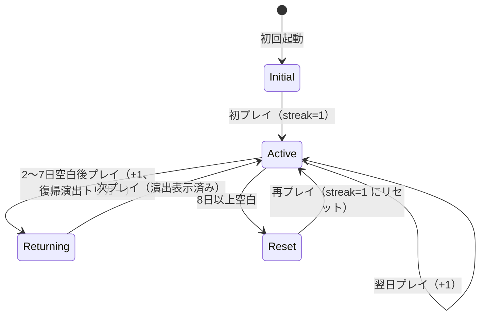

# プロジェクト用語集 (Glossary)

> **プロダクト**: Brain Boost
> **バージョン**: v1.0 (MVP)
> **最終更新**: 2026-04-10

このドキュメントは、Brain Boost プロジェクトのすべてのドキュメント・コードで使用される用語を統一的に定義する。**新しい概念を導入するときは必ずここに追加する**こと（ユビキタス言語の維持）。

---

## ドメイン用語（プロダクト固有）

### ゴースト対戦 (Ghost Battle)

**定義**: プレイヤーが過去の自分（「いつもの自分」）と対戦する Brain Boost の最大の独自要素。

**説明**: 比較対象は**直近5回プレイの平均**。勝率が自然に約50%に収束する設計で、毎日接戦を演出する。他の脳トレアプリにはゼロの独自要素。

**関連用語**: いつもの自分、ベスト記録、ゴーストデータ、解放モデル、プログレスバー

**使用例**:
- 「ゴースト対戦システムは PRD の FR-02 で定義されている」
- 「ゴースト対戦は2段階で解放される（機能解放 → ゲーム別データ成立）」

**英語表記**: Ghost Battle / Ghost Mode

---

### いつもの自分 (Usual Self)

**定義**: ゴースト対戦の比較対象の表示名。直近5回プレイの平均から生成される仮想の「過去の自分」。

**説明**: 内部的には「直近5回平均」だが、UIでは物語性を持たせるために「いつもの自分」と呼ぶ。「昨日の自分」「平均」よりも感情的に響くため。

**関連用語**: ゴースト対戦、ゴーストデータ

**使用例**:
- 「いつもの自分に勝利！ +2問差」
- 「いつもの自分のバーを控えめに表示する」

**英語表記**: Usual Self（直訳）。v2.0 英語版では "Past You" 等を検討。

---

### ゴーストデータ (Ghost Data / `GhostData`)

**定義**: ゴースト対戦で使用される、直近5回のプレイログを平均化した派生データ。

**説明**: タイム系ゲームではプレイ中にプログレスバーとして再生され、クリア系ゲームでは結果画面でタイム比較に使われる。`PlayLog` から動的に計算可能だが、計算コストを下げるためキャッシュする（保存キーは `DataStore.StoreKey.GHOST_CACHE`）。

**主要フィールド**:
- `gameType`: 対象ゲーム種別
- `isReady`: 5件揃っているか
- `averageEvents`: 平均化されたイベント列（100ms刻み、タイム系のみ）
- `averageScore`: 平均スコア
- `averageDurationMs`: 平均クリアタイム（クリア系で使用）
- `averageTapCount`: 平均タップ数（神経衰弱のみ）

**関連用語**: いつもの自分、`PlayLog`、タイム系ゲーム、クリア系ゲーム、あと○回で生まれます

**実装箇所**: `scripts/core/ghost_system.gd`、`scripts/models/ghost_data.gd`

> **注**: 一部の旧ドキュメントで `GhostCache` という名称が使われることがあるが、正式名称は `GhostData`。保存先キーだけが `GHOST_CACHE` という enum 値を持つ。

---

### ゴースト生霊キャラクタ (Ghost Spirit Character / `GhostCharacter`)

**定義**: Brain Boost の **第 3 の独自要素**。ゴースト対戦 (FR-02) のデータを、**ユーザ自身の生霊** として視覚化する再利用可能な UI コンポーネント。全画面共通で登場し、精度 / 脳年齢 / ストリークに応じて見た目が変わり、吹き出しで対話式に案内する。

**コンセプト**: ゴーストは **ユーザ本人** であり、別個のマスコットキャラクタではない。"昨日の自分に挑め" というキャッチコピーを文字通り可視化する装置。データ層 (`GhostData`) は §5b、視覚・ナラティブ層 (`GhostCharacter`) は §5e と役割が分離している。

**ユーザ指標 → ゴースト表現**:
- **精度 %** → 不透明度（alpha = 0.25 + accuracy × 0.75）。精度 0% は希薄、100% で完全現出 [v1.0 MVP]
- **セリフ** → 吹き出しテキスト [v1.0 MVP]
- **脳年齢** → 見た目年齢 [v1.1]
- **ストリーク** → オーラ・発光強度 [v1.1]
- **ベスト更新** → 喜びモーション [v1.1]
- **表情** → idle / happy / tired / surprised / celebrating の 5 ポーズ [v1.1]

**関連用語**: ゴースト対戦、ゴーストデータ、現出度、生霊、精度、脳年齢

**実装箇所**: `scenes/ui/ghost_character.tscn`、`scripts/ui/ghost_character.gd`、`assets/characters/ghost_placeholder.svg`

**参照**: GDD §5e、PRD FR-14、`docs/design/patterns.md` §5、`memory/project_ghost_character.md`

---

### 現出度 (Manifestation Level)

**定義**: ゴースト生霊キャラクタの **不透明度** を決定する派生指標。ユーザの精度 % から算出する。

**計算式**:
```
alpha = 0.25 + accuracy × 0.75

# 精度 0%   → alpha 0.25 (ぼんやり見える)
# 精度 50%  → alpha 0.625
# 精度 100% → alpha 1.00 (くっきり現出)
```

**設計意図**: 最低 25% の透明度を確保することで、精度 0% でも生霊の存在感を完全消失させない（UI 要素として常に配置されていることを示す）。精度が上がる = 練習すればするほど生霊が "濃くなる" というメタファが、§5 の精度システムを視覚的に訴求する装置として機能する。

**関連用語**: ゴースト生霊キャラクタ、精度、解放モデル

**実装箇所**: `scripts/ui/ghost_character.gd::set_accuracy()`

---

### 生霊 (Living Spirit / Ikiryō)

**定義**: 日本民俗学における「生きている人間の魂が肉体から離れて現れる存在」。Brain Boost では **ユーザ自身の過去自分の人格化** として借用している（悪霊の意味ではなく、ポジティブな分身として再解釈）。

**Brain Boost での用法**: ゴースト対戦のデータ対象である「いつもの自分（直近 5 回平均）」を、生霊という概念で視覚的・物語的に統合した。別のマスコットキャラクタを配置するのではなく、ユーザ本人の分身を隣に立たせることで、自己対戦体験を "鏡を見る" 体験に昇華する。

**語感の注意**: "幽霊 (dead spirit)" ではなく "生霊 (living spirit)" という選択が重要。ユーザは生きているので、その分身も生きている。ネガティブな連想を避けるために英訳は "Ghost Spirit" または "Living Spirit" を使い、"Haunt" / "Dead" 系の訳語は避ける。

**関連用語**: ゴースト生霊キャラクタ、いつもの自分

---

### 解放モデル / 2段階解放 (Two-Stage Unlock)

**定義**: ゴースト対戦機能が段階的に解放される設計モデル。

**説明**:
- **第1段階（機能解放）**: 精度100%（全6種1回以上プレイ）達成で、ゴースト対戦機能全体のロックが外れる
- **第2段階（ゲーム別データ成立）**: 各ゲーム個別に5回プレイ蓄積で、そのゲームの実際のゴーストが生成・表示される

全6種を1回ずつやった直後は機能解放のみで、実際のゴーストは各ゲーム5プレイ目から徐々に成立する。

**関連用語**: 精度、ゴースト対戦、あと○回で生まれます

**実装箇所**: `GhostSystem.is_feature_unlocked()` / `is_ready_for_game()`

---

### あと○回で生まれます (Ghost Incubation Message)

**定義**: 各ゲームでゴーストデータが成立するまでの残りプレイ回数を示す UI 文言。

**説明**: 第1段階（機能解放）を通過済みでも、該当ゲームのプレイログが 5 件未満の場合、プレイ前や結果画面で「あと○回で『いつもの自分』が生まれます！」と表示される。これにより**「ゴースト機能は解放されたが、まだ実際の対戦は始まっていない」** 状態をユーザーに伝える。

**実装**: `GhostSystem.get_plays_until_ready(game_type)` が `5 - current_play_count` を返し、UI 側でテキストに埋め込む。

**関連用語**: ゴースト対戦、解放モデル、ゴーストデータ

**実装箇所**: `scripts/core/ghost_system.gd`、結果画面 / ホーム画面 / ルール説明画面の UI コントローラ

---

### 精度 (Accuracy / Measurement Accuracy)

**定義**: ユーザーの脳年齢測定の信頼性を示すパーセント指標。`プレイ済み種目数 / 全種目数 × 100%`

**説明**: 全6種をプレイすると100%。1種でも脳年齢は出る（暫定）が、100%になるまで以下がロックされる:
- ゴースト対戦機能
- 能力レーダーチャート
- 正式脳年齢（「約○○歳」→「○○歳（確定）」）

精度はゲーム数に依存しないパーセント表示のため、v1.1 で新ゲームが3種追加されると自動的に 6/9=67% に下がり、新ゲームをプレイする動機になる。

**関連用語**: 暫定脳年齢、正式脳年齢、解放モデル

**実装箇所**: `ScoreSystem.calculate_accuracy()`

**英語表記**: Accuracy

---

### 暫定脳年齢 / 正式脳年齢 (Tentative / Final Brain Age)

**定義**:
- **暫定脳年齢**: 精度 < 100% のときに「約○○歳」と表示される脳年齢
- **正式脳年齢**: 精度 = 100% のときに「○○歳（確定）」と表示される脳年齢

**説明**: 途中離脱しても1種からでも脳年齢が出るが、全種プレイすることで信頼性の高い確定値になる。

**関連用語**: 精度、解放モデル

---

### 基準年齢 (Base Age)

**定義**: 脳年齢算出で使用する、ユーザーの年代の中央値となる参照年齢。

**説明**: オンボーディングで年齢入力を求めず、デフォルト **30歳**で算出する。設定画面で年代（10代/20代/30代/40代/50代以上）を任意変更すると、それに対応する中央年齢が使われる。

| 年代 | 中央年齢 |
|---|---|
| 10s | 15 |
| 20s | 25 |
| 30s（デフォルト） | 30 |
| 40s | 45 |
| 50s+ | 55 |

**関連用語**: 脳年齢、年代

**実装箇所**: `ScoreSystem.AGE_GROUP_CENTER`

---

### 脳年齢 (Brain Age)

**定義**: 合計スコアを「歳」の単位に翻訳した表示値。**エンターテインメント目的**であり、医学的効果や診断効果は一切保証しない。

**説明**:
- 初回プレイは「基準年齢 - 3〜5歳」に出るよう調整（やや甘め）
- 最低でも「基準年齢 + 10歳」を超えないキャップ
- スコアが上がれば若返る線形変換
- 表示時には必ず「エンターテインメント目的」の注記を添える（法務要件）

**関連用語**: 基準年齢、暫定脳年齢、正式脳年齢、合計スコア

**実装箇所**: `ScoreSystem.calculate_brain_age()` / `docs/functional-design.md` A-02

**英語表記**: Brain Age

---

### 能力軸 (Ability Axis)

**定義**: レーダーチャートを構成する6つの能力カテゴリ。**6つで固定**し、ゲームが増えても軸は増やさない。

**6能力軸**:

| 能力軸 | 代表ゲーム（MVP） | v1.1 追加予定 |
|---|---|---|
| 計算力 (Calculation) | フラッシュ暗算 | — |
| 記憶力 (Memory) | 順番記憶 | 瞬間記憶 |
| 注意力 (Attention) | ストループ | — |
| 反射速度 (Reflex) | 反射タップ | — |
| 観察力 (Observation) | 数字さがし | — |
| 判断力 (Judgment) | 神経衰弱 | 推理、空間認知 |

**説明**: 同じ軸に複数ゲームがある場合、その能力のスコアは平均値で算出される。ゲームが増えるほど安定する。

**関連用語**: レーダーチャート、弱点導線

**実装箇所**: `ScoreSystem.GAME_TO_ABILITY`

---

### レーダーチャート (Radar Chart)

**定義**: 6つの能力軸を6角形で可視化する図。総合結果画面の詳細エリアに表示される。

**説明**: 精度100%で初めて解放される。弱い能力から該当ゲームに直接飛べる「鍛える」ボタン（弱点導線）を併設する。

**関連用語**: 能力軸、弱点導線、精度

**実装箇所**: `scripts/ui/radar_chart_controller.gd`

---

### 弱点導線 (Weakness Path / Improvement Shortcut)

**定義**: レーダーチャートで最も弱い能力から、該当ゲームに直接遷移できるボタン/リンク。

**説明**: レーダーチャートが「見て終わり」にならないための継続導線。GDD §6 の「継続導線」に基づく。

**関連用語**: レーダーチャート、能力軸

---

### デイリーチャレンジ (Daily Challenge)

**定義**: 日付シードで全ユーザー共通の問題が出題される、1日1セットのミニゲーム3種セット。

**説明**: Wordle 方式。同じ問題を解くため、スコア比較が公平で、シェアURL経由の対戦が成立する。6種から3種がシードで選出される。

**関連用語**: 日付シード、シェアURL、フリー選択モード

**実装箇所**: `scripts/core/daily_seed.gd`

**英語表記**: Daily Challenge

---

### 日付シード (Daily Seed)

**定義**: 日付（`YYYYMMDD` 8桁整数）から生成される RNG シード値。

**説明**: 例えば2026年4月15日なら `20260415`。このシードを `RandomNumberGenerator.seed` に設定することで、全ユーザーが同じ問題順・同じ問題内容をプレイできる。ローカルタイム（UTC+9）基準で判定する。

**関連用語**: デイリーチャレンジ、RNG、UTC+9

**実装箇所**: `DailySeed.get_daily_seed()`

**英語表記**: Daily Seed

---

### シェアURL (Share URL)

**定義**: Web版で生成される、スコアと日付を埋め込んだデイリーチャレンジ挑戦URL。

**フォーマット**:
```
https://brain.reigals.com/daily?d=YYYYMMDD&s=スコア
```

**説明**: Xなどで共有されると、相手が同じ日付シードのチャレンジに挑戦でき、スコア比較ができる。OGPメタタグで X/LINE にカード表示される。**Web版限定**。Android版ではテキスト共有に fallback する。

**関連用語**: OGP、デイリーチャレンジ、日付シード、バイラル拡散

**実装箇所**: `scripts/ui/share_screen_controller.gd`, `web/ogp/`

---

### OGP (Open Graph Protocol)

**定義**: SNS でURLを共有したときにタイトル・画像・説明をカード表示するためのメタタグ仕様。

**本プロジェクトでの用途**: Web版シェアURL を X / LINE に貼ったときのカード表示。MVP では静的 PNG 1枚を使い、v1.1 以降で日付＋スコアを焼き込む動的生成を検討。

**関連用語**: シェアURL

---

### ストリーク (Streak)

**定義**: 1回以上プレイした日の連続カウント。

**説明**: 日常的なやる気の演出。**ペナルティなし**の設計で、7日までの空白は維持、8日以上でリセット。既存アプリの「1日休んだらゼロリセット」の最大の不満を回避する。

**空白日の挙動**（詳細は `docs/functional-design.md` A-06）:

| 経過日数 | 挙動 | `welcome_back_shown` |
|---|---|---|
| 0日（同日再プレイ） | 変動なし | 変更なし |
| 1日（翌日プレイ） | `currentStreak += 1` | 変更なし |
| 2〜7日 | `currentStreak += 1` + 復帰演出を次回1度だけ表示 | `false` にセット |
| 8日以上 | `currentStreak = 1` にリセット、復帰演出は出さない | `true` にセット |

**状態遷移図**:



**関連用語**: ハンコ、キャッチアップ、復帰演出、`StreakState`、`welcome_back_shown`

**実装箇所**: `scripts/core/streak_service.gd`、`scripts/models/streak_state.gd`

---

### キャッチアップ (Catch-up)

**定義**: ストリークが途切れそうになっても、7日以内に復帰すればリセットされずに継続できる仕組み。

**関連用語**: ストリーク、復帰演出

---

### 復帰演出 (Welcome Back Animation)

**定義**: 2〜7日の空白後に再開したユーザーに対して、ホーム画面で一度だけ表示する歓迎メッセージ。

**例**: 「おかえりなさい！ストリーク ○日 継続中」

**関連用語**: ストリーク、キャッチアップ

---

### ハンコ (Stamp)

**定義**: 1日1回、プレイするとカレンダーUIに押されるスタンプ。

**説明**: 毎日脳トレの好評機能をパクった設計。視覚的な継続実感を提供する。`StreakState.stampedDates` で管理される。

**関連用語**: ストリーク、カレンダーUI

**英語表記**: Stamp

---

### 総合結果画面 (Overall Result Screen)

**定義**: デイリーチャレンジ3種または初回オンボーディング完了後に表示される画面。

**説明**: ペルソナ2（ライトコンペティター）が3秒でサマリーを把握しシェアできるよう、**ファーストビューと詳細**の2層構成。

- **ファーストビュー**: 合計スコア + 前回比 + ゴースト総合勝敗 + 脳年齢 + [シェア]
- **スクロール先**: 各ゲーム個別スコア + レーダーチャート + 弱点導線 + [詳細分析(広告)]

**関連用語**: 個別結果画面、2層構成

---

### 個別結果画面 (Individual Result Screen)

**定義**: 各ミニゲーム終了直後に表示される、そのゲーム単体の結果画面。

**表示内容**: スコア、前回比、ベスト記録、ゴースト対戦結果、[次のゲームへ] / [結果を見る]

**関連用語**: 総合結果画面、ベスト記録

---

### 2層構成 (Two-Layer Structure)

**定義**: ファーストビュー（スクロール前）と詳細（スクロール後）を明確に分ける画面設計。

**説明**: 2つのペルソナ（短時間派/詳細派）を1画面で両立させるための設計パターン。特に総合結果画面で採用。

---

### ベスト記録 (Best Score)

**定義**: 各ゲームでのユーザー個人の最高スコア。

**説明**: ゴースト（直近5回平均）とは別枠で常時表示される。更新時は⭐アニメーション等の特別演出が入る。

**関連用語**: ゴーストデータ、スコア

**実装箇所**: `GameBest` モデル、`scripts/models/game_best.gd`

---

### タイム系ゲーム / クリア系ゲーム (Time-based / Clear-based Game)

**定義**: ゲーム分類の2種類。

| 分類 | ゲーム | ゴーストUI |
|---|---|---|
| **タイム系** | 反射タップ / フラッシュ暗算 / ストループ | プレイ中にプログレスバー2本（自分 vs いつもの自分） |
| **クリア系** | 順番記憶 / 神経衰弱 / 数字さがし | プレイ中はゴースト非表示、結果画面でタイム比較 |

**説明**: クリア系はプレイ中に他情報を出すと集中を妨げるため、ゴーストバーを出さない。

**関連用語**: ゴースト対戦、プログレスバー

---

### パラメトリック生成 (Parametric Generation)

**定義**: ミニゲームの問題をあらかじめ固定せず、RNG パラメータで毎回動的に生成する設計。

**説明**: 既存アプリ「みんなの脳トレ」の「パターンが固定で飽きる」という口コミ不満への対策。全ゲームで必須要件（PRD FR-01）。

**関連用語**: RNG、日付シード

---

### フリー選択モード (Free Mode)

**定義**: ホーム画面の [全ゲーム一覧] から任意のゲームを自由に選んでプレイするモード。

**説明**: デイリーチャレンジ（全ユーザー共通問題）と異なり、ランダムシードで問題が生成される。記録はゲーム別ベスト記録に反映されるが、デイリーとは別扱い。

**関連用語**: デイリーチャレンジ

**実装箇所**: `GameManager.start_free_game()`

---

### オンボーディング (Onboarding)

**定義**: 初回起動時の「脳力測定テスト」。6種を順次プレイしながらチュートリアル・初期データ収集・初回脳年齢表示をすべて兼ねる。

**説明**: 30秒で1種目目完了 → 暫定結果 → 続ける/やめる、のサイクル。途中離脱OK（暫定脳年齢のみ表示）。

**関連用語**: 暫定脳年齢、精度、初回フロー

---

## 技術用語

### Godot Engine

**定義**: オープンソースのクロスプラットフォームゲームエンジン。

**公式サイト**: https://godotengine.org

**本プロジェクトでの用途**: Brain Boost の唯一のランタイム。単一コードベースから Web (HTML5) と Android を同時エクスポート。

**バージョン**: 4.3 以降（LTS 候補）

**関連ドキュメント**: `docs/architecture.md` テクノロジースタック

---

### GDScript

**定義**: Godot ネイティブのスクリプト言語。Python に似た構文を持つ型付け可能な言語。

**本プロジェクトでの用途**: すべてのゲームロジック・UI・サービスレイヤーの実装言語。

**バージョン**: Godot 4.3 同梱バージョン

**関連**: `docs/development-guidelines.md` コーディング規約

---

### godot-admob-plugin

**定義**: Godot 用の AdMob 広告表示プラグイン。

**公式**: godot-sdk-integrations 版を採用（GDD §3 で指定）

**本プロジェクトでの用途**: Android版の広告表示。バナー/インタースティシャル/リワードの3種類を扱う。

**バージョン**: Godot 4 対応の最新版

**配置**: `addons/admob/`

**関連用語**: AdMob、Android版

---

### AdMob

**定義**: Google が提供するモバイルアプリ向け広告配信プラットフォーム。

**公式**: https://admob.google.com

**本プロジェクトでの用途**: Android版のマネタイズ。Web版では使用しない（ネイティブ SDK のため）。

**関連用語**: godot-admob-plugin、広告種別、`AdService`

---

### 広告種別 (Ad Types)

**定義**: AdMob が提供する広告フォーマットのうち、Brain Boost で使用する 3 種類。

| 種別 | 表示タイミング | 頻度 | 備考 |
|---|---|---|---|
| **バナー広告** (Banner Ad) | **ホーム画面下部のみ** 常時表示 | 常時 | ゲーム画面では絶対表示しない |
| **インタースティシャル広告** (Interstitial Ad) | 総合結果画面 → ホーム遷移時のみ | **3回に1回** | ゲーム間には絶対挟まない |
| **リワード広告** (Rewarded Ad) | ユーザー任意（「詳細分析を見る」「もう1回チャレンジ」） | ユーザー操作時のみ | 価値提供型。押し付けない |

**絶対ルール**（GDD §7 / 開発ガイドライン §2）:
- **ゲームプレイ中は絶対に広告を表示しない**
- **ゲーム間に広告を挟まない**
- スキップ不可の動画広告は使わない
- Web版では一切の広告を表示しない（MVP）
- 広告非表示買い切り購入済みユーザーにはすべての広告を無効化する

**関連用語**: AdMob、`AdService`、広告非表示買い切り

---

### Google Play Billing

**定義**: Google Play が提供するアプリ内課金 API。

**本プロジェクトでの用途**: 広告非表示の買い切り課金（non-consumable product）の実装。

**関連用語**: 買い切り課金、non-consumable

---

### Cloudflare Pages

**定義**: Cloudflare が提供する静的サイト/JAMstack アプリ向けホスティングサービス。

**公式**: https://pages.cloudflare.com

**本プロジェクトでの用途**: Web版（`brain.reigals.com`）のホスティング。`_headers` ファイルで COOP/COEP を設定可能。

**関連用語**: COOP、COEP、Web版

---

### COOP / COEP

**定義**:
- **COOP** (Cross-Origin-Opener-Policy): 開かれたウィンドウのクロスオリジン分離
- **COEP** (Cross-Origin-Embedder-Policy): 埋め込みリソースのクロスオリジン制限

**本プロジェクトでの用途**: Godot 4 の Web Export は WebAssembly の `SharedArrayBuffer` を使うため、ブラウザが要求するクロスオリジン分離ヘッダーの設定が必須。設定しないと起動時にクラッシュする。

**設定値**:
```
Cross-Origin-Opener-Policy: same-origin
Cross-Origin-Embedder-Policy: require-corp
```

**設定場所**: `web/_headers`（Cloudflare Pages）

**関連用語**: SharedArrayBuffer、Web版

---

### SharedArrayBuffer

**定義**: JavaScript のマルチスレッド共有メモリ API。

**本プロジェクトでの用途**: Godot Web Export の内部で必須。COOP/COEP が設定されたオリジンでのみ利用可能。

**関連用語**: COOP、COEP

---

### localStorage

**定義**: ブラウザのキー/バリュー永続化 API。ドメインごとに5〜10MB。

**本プロジェクトでの用途**: Web版でのユーザーデータ保存先。`JavaScriptBridge` 経由で GDScript から操作する。

**関連用語**: JavaScriptBridge、DataStore、Web版

---

### JavaScriptBridge

**定義**: Godot 4 の Web Export 用 API。GDScript から JavaScript を実行できる。

**本プロジェクトでの用途**: Web版での `localStorage` アクセス、`window.location.search` からのシェアURLパラメータ取得。

**関連**: `scripts/autoload/data_store.gd`

---

### user:// (Godot User Path)

**定義**: Godot が提供する OS 固有のユーザーデータディレクトリへのパス接頭辞。

**本プロジェクトでの用途**: Android版でのユーザーデータ保存先。`FileAccess` API で読み書きする。

**関連用語**: DataStore、Android版

---

### GUT (Godot Unit Test)

**定義**: Godot 用のユニットテストフレームワーク。

**公式**: https://github.com/bitwes/Gut

**本プロジェクトでの用途**: `scripts/core/` のサービスクラスのユニットテスト。

**バージョン**: 9.x 以降

**配置**: `addons/gut/`

---

### Autoload (Singleton)

**定義**: Godot の機能で、アプリ起動時に自動インスタンス化されて全シーンからグローバルにアクセス可能なノード。

**本プロジェクトでの用途**: `GameManager`, `DataStore`, `AudioService`, `AdService`, `BillingService`, `Platform` をシングルトンとして登録。`scripts/core/` のサービスクラスは Autoload にしない（テスト容易性のため）。

**関連ドキュメント**: `docs/repository-structure.md` Autoload 節

---

### GameManager（`scripts/autoload/game_manager.gd`）

**定義**: アプリ全体のライフサイクル管理、プレイモード（daily/free/onboarding）の保持、シーン遷移の調停を担う Autoload。

**責務**: 初回起動判定、オンボーディング進行、ミニゲーム開始・完了時のイベント中継、プレイログの `DataStore` への保存指示。

**実装箇所**: `scripts/autoload/game_manager.gd`

---

### DataStore（`scripts/autoload/data_store.gd`）

**定義**: JSON データの読み書きを担う永続化の唯一の窓口（Autoload）。

**責務**: `StoreKey` enum で指定されたエンティティを読み書きし、プラットフォーム分岐（Web: localStorage / Android: `user://`）を `Platform` 経由で判定。スキーマバージョンのマイグレーションも担当。

**主要メソッド**: `save(key, data)`, `load(key)`, `exists(key)`, `clear(key)`, `migrate_if_needed(version)`

**StoreKey 列挙**: `USER_CONFIG`, `PLAY_LOGS`, `GAME_BESTS`, `STREAK_STATE`, `GHOST_CACHE`

**実装箇所**: `scripts/autoload/data_store.gd`

---

### AudioService（`scripts/autoload/audio_service.gd`）

**定義**: BGM と効果音の再生・管理を担う Autoload。

**責務**: `UserConfig.bgmEnabled` / `seEnabled` の尊重、Web版での音声自動再生制限の回避（最初のタップで `AudioServer` を初期化）、オーディオフォーカスの管理（Spotify 等と共存可能）。

**実装箇所**: `scripts/autoload/audio_service.gd`

---

### AdService（`scripts/autoload/ad_service.gd`）

**定義**: 広告表示を抽象化した Autoload。

**責務**: バナー/インタースティシャル/リワードの表示メソッドを提供。Web版では no-op、Android版では `godot-admob-plugin` を呼び出す。広告非表示購入済みユーザーに対してはすべてのメソッドが no-op になる。

**主要メソッド**: `show_banner()`, `hide_banner()`, `show_interstitial()`, `show_rewarded(callback)`

**実装箇所**: `scripts/autoload/ad_service.gd`

---

### BillingService（`scripts/autoload/billing_service.gd`）

**定義**: Google Play Billing の広告非表示買い切り課金を抽象化した Autoload。

**責務**: 購入フローの起動、購入状態の復元（`queryPurchasesAsync()`）、`UserConfig.hasPurchasedAdFree` の更新。Web版では常に `false` を返す no-op。

**主要メソッド**: `is_ad_free()`, `purchase_ad_free()`, `restore_purchases()`

**実装箇所**: `scripts/autoload/billing_service.gd`

---

### Platform（`scripts/autoload/platform.gd`）

**定義**: プラットフォーム判定（`OS.get_name()`）を集約する Autoload。

**責務**: 全コードで散在しがちな `OS.get_name() == "Web"` 判定を 1 箇所にまとめ、テスト時のモック可能にする。

**主要メソッド**: `current() -> Target`, `supports_admob()`, `supports_billing()`, `supports_share_url()`, `storage_strategy()`

**実装箇所**: `scripts/autoload/platform.gd`

---

### BaseGame（`scripts/games/base_game.gd`）

**定義**: 全 6 種ミニゲームの基底クラス。ゲームコアレイヤーの中核。

**責務**: 共通のライフサイクル（`setup`, `start`, `on_user_input`, `on_finish`）、タイマー管理、イベント記録、`game_finished` シグナルの発火。サブクラスでゲーム固有のロジックを実装する。

**継承関係**: 各ミニゲーム（`reflex_tap.gd`, `flash_calc.gd` 等）は `BaseGame` を継承する。

**関連用語**: タイム系ゲーム、クリア系ゲーム、パラメトリック生成

**実装箇所**: `scripts/games/base_game.gd`

---

### SchemaMigrator（`scripts/core/schema_migrator.gd`）

**定義**: JSON 永続化データのスキーマバージョンを検知し、将来のバージョンへ移行するユーティリティ。

**責務**: `schemaVersion` フィールドを読み、必要に応じて旧構造から新構造へフィールド変換する。MVP は `schemaVersion = 1` のみで実移行は発生しないが、将来のために空の migrator を用意しておく。

**実装箇所**: `scripts/core/schema_migrator.gd`

---

## 略語・頭字語

### PRD (Product Requirements Document)

**正式名称**: Product Requirements Document

**意味**: プロダクト要求定義書

**本プロジェクトでの使用**: `docs/product-requirements.md` がこれに相当

---

### GDD (Game Design Document)

**正式名称**: Game Design Document

**意味**: ゲーム設計書

**本プロジェクトでの使用**: `docs/ideas/brain_training_gdd.md`。すべての設計判断の根拠となる「北極星」ドキュメント

---

### FR (Functional Requirement)

**正式名称**: Functional Requirement

**意味**: 機能要件

**本プロジェクトでの使用**: PRD の機能要件に `FR-01`〜`FR-13` で番号付けされている

---

### UC (Use Case)

**正式名称**: Use Case

**意味**: ユースケース

**本プロジェクトでの使用**: 機能設計書のユースケース図に `UC-01`〜`UC-04` で番号付けされている

---

### MVP (Minimum Viable Product)

**正式名称**: Minimum Viable Product

**意味**: 実用最小限の製品

**本プロジェクトでの使用**: v1.0 の範囲を指す。1ヶ月スコープで市場投入可能な最小構成

---

### DAU (Daily Active Users)

**正式名称**: Daily Active Users

**意味**: 1日あたりアクティブユーザー数

**本プロジェクトでの使用**: PRD のプライマリー KPI

---

### D1 / D7 継続率

**正式名称**: Day-1 / Day-7 Retention Rate

**意味**: 初日プレイ → 翌日 / 7日後にもプレイしたユーザーの比率

**本プロジェクトでの使用**: PRD のプライマリー KPI

---

### UI / UX

**正式名称**: User Interface / User Experience

**意味**: ユーザーインターフェース / ユーザー体験

---

### RNG (Random Number Generator)

**正式名称**: Random Number Generator

**意味**: 乱数生成器

**本プロジェクトでの使用**: Godot の `RandomNumberGenerator` クラス。日付シードを設定することで決定論的な問題生成に使う

---

### COOP / COEP

**定義**: 上記「技術用語」を参照

---

### JST / UTC+9

**正式名称**: Japan Standard Time

**意味**: 日本標準時

**本プロジェクトでの使用**: すべての日付判定（デイリーシード、ストリーク、ハンコ）は JST 固定で行う。深夜の境界問題を避けるため

---

### COPPA

**正式名称**: Children's Online Privacy Protection Act

**意味**: 米国の13歳未満のオンラインプライバシー保護法

**本プロジェクトでの使用**: AdMob の広告配信設定で13歳未満向け広告を無効化する際の根拠

---

### MBTI

**正式名称**: Myers-Briggs Type Indicator

**意味**: 性格類型の心理テスト

**本プロジェクトでの使用**: v1.2 以降に検討する「脳タイプ診断」の参考モデルとして言及される

---

## アーキテクチャ用語

### レイヤードアーキテクチャ (Layered Architecture)

**定義**: システムを責務の明確な層に分割する設計パターン。

**本プロジェクトでの適用**: UI / ゲームコア / サービス / データストア / プラットフォームの5層構造。上位層のみが下位層に依存し、逆は禁止される。

**関連コンポーネント**: `scripts/ui/`, `scripts/games/`, `scripts/core/`, `scripts/autoload/data_store.gd`, `scripts/autoload/platform.gd`

**図解**:
```
UI → ゲームコア → サービス → データストア → プラットフォーム
```

**関連ドキュメント**: `docs/architecture.md` アーキテクチャパターン

---

### サーバレス (Serverless)

**定義**: バックエンドサーバを持たず、すべてのロジックとデータがクライアント側で完結するアーキテクチャ。

**本プロジェクトでの適用**: Brain Boost は MVP ではサーバを持たない。データはローカルに保存され、ネットワーク通信は広告配信時のみ。シェアURL も URL パラメータだけで成立しているためサーバ不要。

---

### プラットフォーム分岐 (Platform Branching)

**定義**: 同一コードベースで Web と Android の異なる振る舞いを実現する設計。

**本プロジェクトでの適用**: `scripts/autoload/platform.gd` に `OS.get_name()` 判定を集約し、広告・データ保存・シェアURL等を `Platform.supports_xxx()` でフラグ化する。

**関連ドキュメント**: `docs/architecture.md` プラットフォーム分岐戦略

---

### Signal（Godot シグナル）

**定義**: Godot のイベント機構。ノード間で疎結合な通信を実現する。

**本プロジェクトでの適用**: 下位レイヤー（ゲームコア）から上位レイヤー（UI/サービス）への通知はすべてシグナルで行う。依存方向の逆転を実現する。

**命名規則**: snake_case、過去形/現在形の動詞（例: `game_finished`, `score_updated`）

**関連ドキュメント**: `docs/development-guidelines.md` シグナルの使い方

---

## ステータス・状態

### StreakState（ストリーク状態）

状態遷移図とフィールド定義はドメイン用語「[ストリーク](#ストリーク-streak)」を参照。

| ステータス | 意味 | 遷移条件 |
|---|---|---|
| **Initial** | 初回起動前 | `last_played_date == ""` |
| **Active** | 連続プレイ中 | 0〜1日の空白後にプレイ |
| **Returning** | 復帰演出中（1度だけ表示） | 2〜7日の空白後にプレイ |
| **Reset** | リセット直後 | 8日以上の空白後にプレイ |

---

### ゲームプレイモード

| モード | 意味 | 記録先 |
|---|---|---|
| `daily` | 今日のデイリーチャレンジ | `PlayLog.mode = "daily"`, `dailySeed = YYYYMMDD` |
| `free` | フリー選択モード | `PlayLog.mode = "free"`, `dailySeed = null` |
| `onboarding` | 初回オンボーディング中 | `PlayLog.mode = "onboarding"`, `dailySeed = null` |

---

## データモデル用語

### UserConfig

**定義**: ユーザー設定と基本情報を保持するエンティティ。

**主要フィールド**:
- `schemaVersion`: データフォーマットバージョン
- `ageGroup`: 年代（null なら基準年齢30歳扱い）
- `bgmEnabled` / `seEnabled`: 音声設定
- `hasPurchasedAdFree`: 広告非表示購入フラグ
- `onboardingCompleted`: オンボーディング完了フラグ

**保存先**: `user://user_config.json` (Android) / `localStorage["brainboost_user_config"]` (Web)

**関連**: `scripts/models/user_config.gd`

---

### PlayLog

**定義**: 1回のミニゲームプレイの詳細記録。ゴースト生成の元データ。

**主要フィールド**:
- `id`: UUID
- `gameType`: ゲーム種別
- `mode`: daily / free / onboarding
- `playedAt` / `playedDate`: プレイ時刻・日
- `dailySeed`: デイリーシード（該当時のみ）
- `score`: スコア
- `events`: タイムスタンプ付きイベント列
- `ghostResult`: ゴースト対戦結果

**制約**: 最大360件保持（60件/ゲーム × 6ゲーム）。超過時は古いものから削除

**関連**: `scripts/models/play_log.gd`

---

### GameBest

**定義**: ゲーム別のベスト記録。

**主要フィールド**: `gameType`, `bestScore`, `bestPlayLogId`, `achievedAt`, `totalPlayCount`

**関連**: `scripts/models/game_best.gd`

---

### StreakState

**定義**: ストリーク（連続プレイ日数）状態のエンティティ。

**主要フィールド**:
- `currentStreak`: 現在の連続日数
- `lastPlayedDate`: 最後にプレイした日（`YYYY-MM-DD`、JST）
- `longestStreak`: 過去最高のストリーク
- `stampedDates`: ハンコが押された日付の配列（カレンダー表示用）
- `welcomeBackShown`: 復帰演出を表示済みか（`false` なら次回ホーム描画で 1 度表示）

**関連**: ドメイン用語「[ストリーク](#ストリーク-streak)」（状態遷移図・更新ロジックはこちら）、`scripts/models/streak_state.gd`

---

### GhostData

**定義**: 直近5回のプレイログから計算されたゴースト対戦用データ（派生データ / キャッシュ）。

**主要フィールド**: `gameType`, `isReady`, `averageEvents`, `averageScore`, `averageDurationMs`

**関連**: `scripts/models/ghost_data.gd`

---

## エラー・警告

GDScript は例外を持たない。本プロジェクトのエラー表現は以下のパターンを使う:

### null 返し / 空値返し

**発生条件**: 取得系メソッドで対象が存在しない・成立していないとき

**例**: `GhostSystem.get_ghost_for_game(game_type)` — 5回未満なら `null`

**対処**: 呼び出し側で `if result == null:` チェック

---

### push_error / push_warning + 既定値フォールバック

**発生条件**: 想定外の引数や内部状態のとき。クラッシュさせずにログを出して既定値を返す

**例**: `ScoreSystem.calculate_score(unknown_game_type, data)` — 警告を出して `0` を返す

---

### assert (開発時のみ)

**発生条件**: 不変条件（invariant）が破れた場合。プログラマーのバグ

**例**: `assert(index >= 0 and index < 6, "game_index out of range")`

**注意**: 本番リリースビルドでは除去されるため、ユーザー入力の検証には使わない

---

### JSON パースエラー

**発生条件**: 保存された JSON ファイルが壊れている、スキーマバージョンが未知

**対処**: 該当エンティティを初期値にフォールバック。`push_error()` でログ

**実装箇所**: `DataStore._load_with_fallback()`, `SchemaMigrator`

---

## 計算・アルゴリズム

### A-01: ゲーム別スコア計算

**定義**: 各ミニゲームの生スコア算出式（PRD FR-04 / 機能設計書 A-01）。

| ゲーム | 式 |
|---|---|
| フラッシュ暗算 | `correct * 100 + remaining_sec * 10` |
| 順番記憶 | `max_level * 150` |
| ストループ | `max(0, correct * 100 - incorrect * 50)` |
| 反射タップ | `min(1500, (1000 / avg_ms) * 300)` |
| 神経衰弱 | `(pair / tap) * 1000 + max(0, time_bonus)` |
| 数字さがし | `max(0, 3000 - clear_sec * 100)` |

**実装箇所**: `scripts/core/score_system.gd :: calculate_score()`

---

### A-02: 脳年齢算出

**定義**: 合計スコアと年代から脳年齢を算出するアルゴリズム。

**計算式**:
```
normalized = clamp(total_score / MAX_TOTAL_SCORE, 0.0, 1.0)
raw_age = center_age + 10 - (normalized * 20)
if is_first_play: raw_age -= rand(3, 5)
brain_age = clamp(raw_age, center_age - 15, center_age + 10)
brain_age = max(brain_age, 10)
```

**定数**: `MAX_TOTAL_SCORE = 17000`

**実装箇所**: `ScoreSystem.calculate_brain_age()` / 機能設計書 A-02

---

### A-03: ゴースト生成（直近5回平均化）

**定義**: 過去5回のプレイイベント列を100ms刻みのタイムグリッドで平均化するアルゴリズム。

**ステップ**:
1. 対象ゲームのログを新しい順に5件抽出（5件未満なら `isReady=false`）
2. 100ms刻みのグリッドで各時点の正答数を平均
3. `GhostData.averageEvents` として保存

**実装箇所**: `GhostSystem._compute_ghost()` / 機能設計書 A-03

---

### A-04: 精度計算

**式**: `精度 = unique(played_game_types) / ALL_GAMES.size()`

**実装箇所**: `ScoreSystem.calculate_accuracy()`

---

### A-05: 日付シード生成

**式**:
```gdscript
func get_daily_seed(date: Dictionary) -> int:
    return date.year * 10000 + date.month * 100 + date.day
```

**例**: 2026年4月15日 → `20260415`

**実装箇所**: `DailySeed.get_daily_seed()`

---

### A-06: ストリーク判定

**定義**: 連続プレイ日数の更新ロジック（PRD FR-09）。

**条件分岐**:
- `diff == 0`: 変動なし
- `diff == 1`: `+1`
- `2 <= diff <= 7`: `+1`、復帰演出フラグ立ち
- `diff >= 8`: `1` にリセット

**実装箇所**: `StreakService.update_streak()` / 機能設計書 A-06

---

## 関連ドキュメント

- **GDD**: `docs/ideas/brain_training_gdd.md`（北極星）
- **PRD**: `docs/product-requirements.md`
- **機能設計書**: `docs/functional-design.md`
- **技術仕様書**: `docs/architecture.md`
- **リポジトリ構造**: `docs/repository-structure.md`
- **開発ガイドライン**: `docs/development-guidelines.md`
- **プロジェクトメモリ**: `CLAUDE.md`

---

## 更新ルール

1. **新しい用語を導入したら必ずこのファイルに追加する**（ユビキタス言語の維持）
2. **PRD・機能設計書と食い違いがあれば即修正する**
3. **英語表記は v2.0 英語対応時に活用されるため、可能な限り併記する**
4. **用語を削除する場合は、削除ではなく「廃止」マークを残し、代替用語を案内する**
